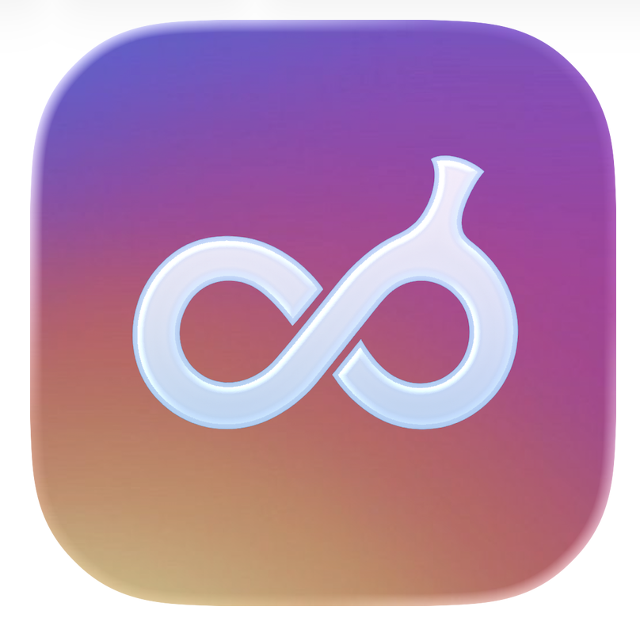

# 🍌 BananaGram

**Reimagining Instagram's magic with AI-powered photo transformations**

BananaGram is an iOS app that brings back the original magic of Instagram filters, enhanced with cutting-edge AI. Instead of fixed filters, BananaGram analyzes each photo and suggests personalized, AI-powered transformations that create truly magical results.

## ✨ Features

- **AI-Powered Analysis**: Uses Google Gemini to understand your photos and suggest perfect transformations
- **Personalized Magic Filters**: Get 5 custom transformation suggestions for every photo
- **Image & Video Creation**: Transform still images into dynamic videos or enhanced photos
- **Instagram-like UI**: Familiar, intuitive interface with smooth animations
- **Secure API Management**: Safe, open-source-ready API key handling

## 🚀 Getting Started

### Prerequisites

- Xcode 15.0 or later
- iOS 17.0 or later
- Swift 5.9 or later

### API Keys Required

You'll need API keys from:
1. **Google Gemini API** - For AI analysis and suggestions
   - Get your key at: https://ai.google.dev/
2. **fal.ai Key Pair** - For image/video transformations using the official fal-swift package
   - Get your key pair at: https://fal.ai/dashboard
   - Format: `FAL_KEY_ID:FAL_KEY_SECRET`

### Installation

1. **Clone the repository**
   ```bash
   git clone https://github.com/your-username/bannanagram.git
   cd bannanagram
   ```

2. **Set up API configuration**
   ```bash
   # Copy the configuration template
   cp Config/Development.xcconfig.template Config/Development.xcconfig
   ```
   
   Edit `Config/Development.xcconfig` with your API keys:
   ```
   FAL_AI_API_KEY = your_fal_ai_api_key_here
   GEMINI_API_KEY = your_gemini_api_key_here
   ```

3. **Configure Xcode Project**
   - Open `Bannanagram.xcodeproj` in Xcode
   - Select the project in the navigator
   - Under "Project > Bannanagram > Info"  
   - Set "Configurations" to use `Config/Development.xcconfig` for Debug

4. **Build and run**
   - Select your target device/simulator
   - Press Cmd+R to build and run

## 🏗️ Architecture

### Core Components

- **MainTabView**: Instagram-style tab navigation
- **CameraView**: Photo capture and upload interface
- **AIAnalysisView**: Real-time AI photo analysis
- **SuggestionSelectionView**: Magic filter carousel
- **ProcessingView**: Transformation progress with animations
- **ResultView**: Before/after comparison and sharing

### Data Models

- **Photo**: Original uploaded images with metadata
- **ImageAnalysis**: AI analysis results from Gemini
- **TransformationSuggestion**: AI-generated transformation options
- **ProcessedMedia**: Final enhanced images/videos

### Services

- **GeminiService**: Handles AI analysis and suggestion generation
- **FALService**: Manages image/video transformations
- **APIConfiguration**: Secure API key management

## 🔧 Development

### Project Structure

```
Bannanagram/
├── Models/              # SwiftData models
├── Views/               # SwiftUI views
├── Services/            # API integration services
├── Config/              # Configuration and security
└── Assets.xcassets/     # App assets
```

### Key Features Implementation

1. **AI Analysis Flow**
   - Photo upload → Gemini API analysis → Structured insights
   - Generates 5 personalized transformation suggestions
   - Fallback to mock suggestions for development

2. **Transformation Pipeline**
   - Suggestion selection → fal.ai API transformation
   - Real-time progress tracking with phases
   - Error handling with retry capabilities

3. **Secure API Management**
   - Environment variable loading
   - Runtime key validation
   - Development-friendly error messages

## 🔒 Security

- API keys are loaded from environment variables
- Never committed to version control (see `.gitignore`)
- Runtime validation ensures keys are present
- Graceful fallback for development without keys

## 🎨 UI/UX Design

- **Instagram-inspired**: Familiar navigation and interactions
- **Magical animations**: Smooth transitions and progress indicators
- **Accessibility**: VoiceOver support and dynamic type
- **Dark mode**: Automatic system appearance adaptation

## 🤝 Contributing

1. Fork the repository
2. Create a feature branch (`git checkout -b feature/amazing-feature`)
3. Commit your changes (`git commit -m 'Add amazing feature'`)
4. Push to the branch (`git push origin feature/amazing-feature`)
5. Open a Pull Request

### Development Guidelines

- Follow Swift coding conventions
- Add tests for new features
- Update documentation for API changes
- Ensure security best practices for API handling

## 📱 Supported Features

- [x] Photo capture and library selection
- [x] AI-powered image analysis
- [x] Personalized transformation suggestions
- [x] Image enhancement transformations
- [x] Creative style transfers
- [x] Video animation generation
- [x] Before/after comparison
- [x] Social media sharing
- [x] Local photo saving

## 🛠️ Troubleshooting

### Common Issues

**"Missing API key" errors**
- Ensure `Config/Development.xcconfig` file exists with your API keys
- Verify Xcode project is configured to use the xcconfig file
- Check API keys are valid and active

**Transformation failures**
- Verify fal.ai API key has sufficient credits
- Check network connectivity
- Review fal.ai model availability

**App crashes on launch**
- Ensure iOS 17.0+ deployment target
- Verify all SwiftData models are properly configured

## 📄 License

This project is licensed under the MIT License - see the LICENSE file for details.

## 🙏 Acknowledgments

- Google Gemini for AI analysis capabilities
- fal.ai for image/video transformation models
- Instagram for UI/UX inspiration
- The Swift and SwiftUI communities

---

**Built with ❤️ for the magic of AI-powered creativity**
